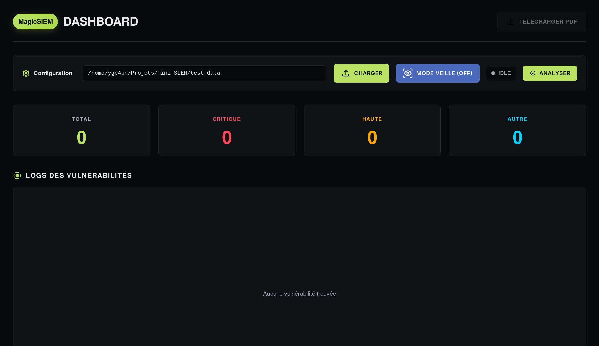
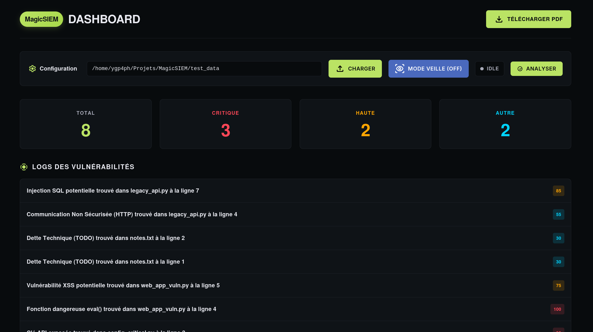

# MagicSIEM

Un outil d'analyse statique de code pour détecter des vulnérabilités basiques.

MagicSIEM scanne des répertoires à la recherche de patterns suspects dans le code source (mots de passe en clair, fonctions dangereuses, etc.).

Le projet comprend :
- Un scanner de fichiers qui cherche des mots-clés dangereux
- Une interface web pour lancer les scans et voir les résultats
- Un mode surveillance qui tourne en arrière-plan
- L'export des résultats en PDF

## Ce que ça fait

**Ce que ça détecte :**
- Mots de passe en dur dans le code
- Clés API exposées
- Utilisation de fonctions dangereuses (eval, etc.)
- Requêtes SQL non paramétrées
- Potentiels XSS
- Connexions HTTP non sécurisées
- Mode debug activé
- TODO et dette technique

### 1. Strategy Pattern

Permet de choisir l'algorithme de scan à la volée. Pour l'instant, il n'y a que FileScan qui est vraiment implémenté.

```python
# Dans Scanner
scanner.set_strategy(FileScan(target_dir, extensions))
scanner.run_scan()
```

Structure :
- `IScanStrategy` : interface abstraite avec une méthode scan()
- `FileScan` : implémentation pour scanner des fichiers

### 2. Observer Pattern

Le système d'alertes reçoit automatiquement une notification quand le scanner trouve quelque chose.

```python
# Dans Scanner.run_scan()
for vuln in raw_results:
    self.findings.append(vuln)
    self.alert_system.send_alert(vuln)  # Notif automatique
```

### Organisation générale

```
Flask (main.py)
    │
    └── Scanner (core/scanner.py)
            ├── Strategy (FileScan / NetworkScan)
            │       └── VulnerabilityDB
            │
            └── AlertSystem (Observer)
```

## Installation

```bash
# Cloner le projet
git clone git@github.com:ygp4ph/MagicSIEM.git
cd MagicSIEM

# Environnement virtuel
python3 -m venv venv
source venv/bin/activate  # Linux/Mac
# ou venv\Scripts\activate sur Windows

# Dépendances
pip install -r requirements.txt
```

Si on veut tester rapidement :
```bash
python setup_test.py  # Génère des fichiers de test avec des vulnérabilités
```

## Utilisation

### Lancer l'application

```bash
python main.py
```

Ouvrir son navigateur sur `http://127.0.0.1:5000`

### Interface web


### Exemple de chemin valide
```
# Linux
/home/ygp4ph/Projets/projet_web

# Windows  
C:\Users\Shaadi\Documents\projet_web
```

Note : Le chemin doit être absolu (commençant par / ou C:\)


## Vulnérabilités détectées

### Critiques (90-100)

| Pattern | Sévérité | Description |
|---------|----------|-------------|
| `exec(` | 100 | Exécution de code arbitraire |
| `eval(` | 100 | Évaluation de code dynamique |
| `password` | 95 | Mot de passe en clair |
| `api_key` | 90 | Clé API exposée |

### Hautes (70-89)

| Pattern | Sévérité | Description |
|---------|----------|-------------|
| `sqli` | 85 | Injection SQL potentielle |
| `shell_exec(` | 80 | Exécution de commande système (PHP) |
| `xss` | 75 | Cross-Site Scripting potentiel |
| `subprocess.call(` | 70 | Appel système non sécurisé (Python) |

### Moyennes (50-69)

| Pattern | Sévérité | Description |
|---------|----------|-------------|
| `debug` | 60 | Mode debug activé |
| `http` | 55 | Communication non chiffrée |
| `console.log(` | 50 | Information divulguée en console |

### Basses (<50)

| Pattern | Sévérité | Description |
|---------|----------|-------------|
| `FIXME` | 45 | Dette technique à corriger |
| `TODO` | 30 | Tâche en attente |

### Résultats d'annalyse

## Structure du projet

```
MagicSIEM/
├── main.py                   # Application Flask et routes API
├── requirements.txt          # Dépendances Python
├── setup_test.py            # Générateur de fichiers de test
│
├── core/                    # Composants principaux
│   ├── scanner.py           # Orchestrateur du scan
│   ├── alert_system.py      # Système d'alertes (Observer)
│   ├── vulnerability.py     # Classes de vulnérabilités
│   └── database.py          # Base de données des vulnérabilités
│
├── strategies/              # Implémentations Strategy
│   ├── scan_strategy.py     # Interface Strategy
│   └── file_scan.py         # Scan de fichiers
│
├── static/                  # Ressources statiques
│   └── style.css           # Styles du dashboard
│
└── templates/               # Templates HTML
    └── index.html          # Interface web
```

Avec le contexte "Production", +20 points de sévérité.

---

sh44di, Advm100, nammsofresh, ygp4ph, Thai-Lung
